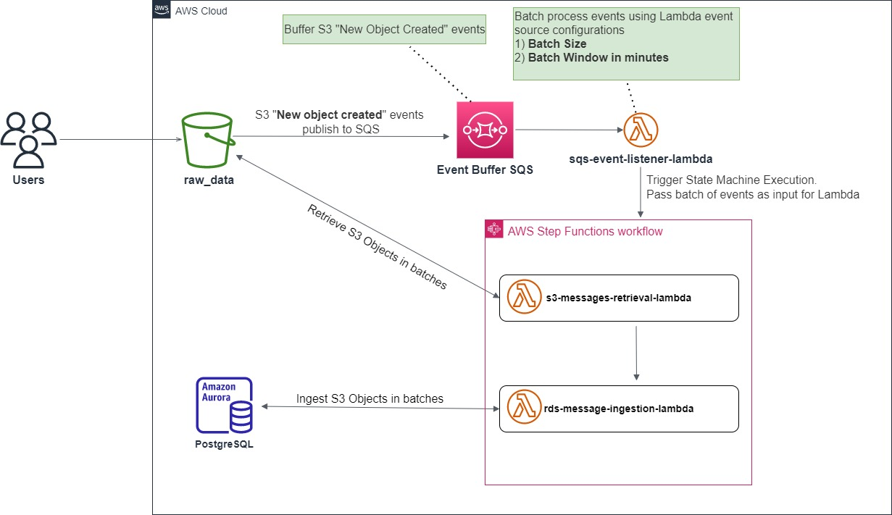
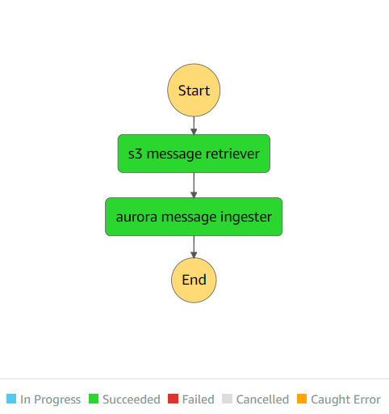

# Solution Overview

## Architecture

The following diagram shows the data ingestion architecture.



The proposed solution is a production-ready AWS fully managed scalable serverless solution.

### AWS Services

-   `S3` for Object store
-   `Serverless Aurora PostgreSQL` as Back End
-   `SQS` for buffering S3 Object Create events
-   `Lambda Function (sqs-event-listener-lambda)` Batch process events using Lambda event source configurations (Batch Size and Batch Window). Trigger State Machine execution and pass event batches as input for Lambda code [here](./src/sqs-event-listener-lambda.ts)

-   `Step Function` process S3 Object Create events in batches, retrieve the S3 Objects, and ingest data into PostgreSQL.

    -   Batch Process S3 Lambda code [here](./src/s3-messages-retrieval-lambda.ts)
    -   Batch Ingest Data Lambda code [here](./src/aurora-message-ingestion-lambda.ts)

-   `CDK` for Infrastructure provisioning and deployment code [here](./lib/project-stack.ts)

### Programming Language

-   TypeScript

## Getting started

### prerequisite

-   An AWS account
-   AWS CLI configured
-   Node.js 14+

To deploy this project, follow these steps.

### Clone the project

```
git clone https://github.com/muditha-silva/data-ingestion-service.git
```

### Install dependencies

```
> npm install
```

### Run the build

```
> npm run build
```

### Deployment Stack Configurations.

Default stack configurations can find here [here](./etc/default.json).

**Important**

-   Change the `RawDataBucketName` property to a unique s3 bucket name. Please note that bucket name is suffixed with {aws-region}. For the default configuration, bucket name is **raw-data-lake-dev-eu-west-1**
-   Lambda SQS event source mapping configurations for Batch Size and Batch Window (in minutes)
    -   `"SQSBatchSize":"100"`
    -   `"SQSBatchWindow":"1"`

### Deploy the stack

Install the CDK globally

```
> npm install -g cdk
```

This stack uses **assets**, therefore the toolkit stack (CDKToolkit) must deploy to the environment if it does not exist.

```
> cdk bootstrap aws://{aws-account}/{aws-region}
```

```
> cdk deploy --o cdk-exports.json
```

### Create the raw_data table

**Connect to Database**

-   Select `Query Editor` from `RDS dashboard` .
-   Select the database name begins with `dataingestionservice-auroradatacluster` from the dropdown menu.
-   For the Database `username`, select `Connect with a Secrets Manager ARN` (use the ARN of the secret name begins with `AuroraDataClusterSecret` from `Secrets manager`).
-   For the default configuration use `RawDataDB` as the database name.

**Create Table Script**

```
    CREATE TABLE raw_data (
    id TEXT NOT NULL PRIMARY KEY,
    data JSONB,
    createDate TEXT NOT NULL
    );
```

**_Table Design_**

-   `data` column, JSONB data type is used for storing JSON data which supports querying, filtering, and indexing JSON data.
-   `createDate` column, if date-specific partitioning is required, create an index.

### Testing

Upload batch of files into s3 raw data bucket.


State Machine Execution



Query Data


